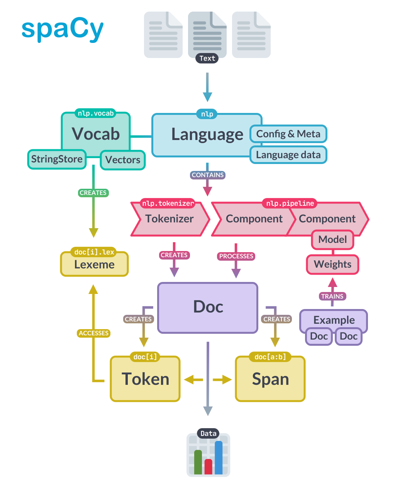

The central data structures in spaCy are the [`Language`](/api/language) class,
the [`Vocab`](/api/vocab) and the [`Doc`](/api/doc) object. The `Language` class
is used to process a text and turn it into a `Doc` object. It's typically stored
as a variable called `nlp`. The `Doc` object owns the **sequence of tokens** and
all their annotations. By centralizing strings, word vectors and lexical
attributes in the `Vocab`, we avoid storing multiple copies of this data. This
saves memory, and ensures there's a **single source of truth**.

Text annotations are also designed to allow a single source of truth: the `Doc`
object owns the data, and [`Span`](/api/span) and [`Token`](/api/token) are
**views that point into it**. The `Doc` object is constructed by the
[`Tokenizer`](/api/tokenizer), and then **modified in place** by the components
of the pipeline. The `Language` object coordinates these components. It takes
raw text and sends it through the pipeline, returning an **annotated document**.
It also orchestrates training and serialization.

### Container objects {#architecture-containers}

| Name                          | Description                                                                                                                                             |
| ----------------------------- | ------------------------------------------------------------------------------------------------------------------------------------------------------- |
| [`Doc`](/api/doc)             | A container for accessing linguistic annotations.                                                                                                       |
| [`DocBin`](/api/docbin)       | A collection of `Doc` objects for efficient binary serialization. Also used for [training data](/api/data-formats#binary-training).                     |
| [`Example`](/api/example)     | A collection of training annotations, containing two `Doc` objects: the reference data and the predictions.                                             |
| [`Language`](/api/language)   | Processing class that turns text into `Doc` objects. Different languages implement their own subclasses of it. The variable is typically called `nlp`.  |
| [`Lexeme`](/api/lexeme)       | An entry in the vocabulary. It's a word type with no context, as opposed to a word token. It therefore has no part-of-speech tag, dependency parse etc. |
| [`Span`](/api/span)           | A slice from a `Doc` object.                                                                                                                            |
| [`SpanGroup`](/api/spangroup) | A named collection of spans belonging to a `Doc`.                                                                                                       |
| [`Token`](/api/token)         | An individual token — i.e. a word, punctuation symbol, whitespace, etc.                                                                                 |

### Processing pipeline {#architecture-pipeline}

The processing pipeline consists of one or more **pipeline components** that are
called on the `Doc` in order. The tokenizer runs before the components. Pipeline
components can be added using [`Language.add_pipe`](/api/language#add_pipe).
They can contain a statistical model and trained weights, or only make
rule-based modifications to the `Doc`. spaCy provides a range of built-in
components for different language processing tasks and also allows adding
[custom components](/usage/processing-pipelines#custom-components).

| Name                                            | Description                                                                                 |
| ----------------------------------------------- | ------------------------------------------------------------------------------------------- |
| [`AttributeRuler`](/api/attributeruler)         | Set token attributes using matcher rules.                                                   |
| [`DependencyParser`](/api/dependencyparser)     | Predict syntactic dependencies.                                                             |
| [`EditTreeLemmatizer`](/api/edittreelemmatizer) | Predict base forms of words.                                                                |
| [`EntityLinker`](/api/entitylinker)             | Disambiguate named entities to nodes in a knowledge base.                                   |
| [`EntityRecognizer`](/api/entityrecognizer)     | Predict named entities, e.g. persons or products.                                           |
| [`EntityRuler`](/api/entityruler)               | Add entity spans to the `Doc` using token-based rules or exact phrase matches.              |
| [`Lemmatizer`](/api/lemmatizer)                 | Determine the base forms of words using rules and lookups.                                  |
| [`Morphologizer`](/api/morphologizer)           | Predict morphological features and coarse-grained part-of-speech tags.                      |
| [`SentenceRecognizer`](/api/sentencerecognizer) | Predict sentence boundaries.                                                                |
| [`Sentencizer`](/api/sentencizer)               | Implement rule-based sentence boundary detection that doesn't require the dependency parse. |
| [`Tagger`](/api/tagger)                         | Predict part-of-speech tags.                                                                |
| [`TextCategorizer`](/api/textcategorizer)       | Predict categories or labels over the whole document.                                       |
| [`Tok2Vec`](/api/tok2vec)                       | Apply a "token-to-vector" model and set its outputs.                                        |
| [`Tokenizer`](/api/tokenizer)                   | Segment raw text and create `Doc` objects from the words.                                   |
| [`TrainablePipe`](/api/pipe)                    | Class that all trainable pipeline components inherit from.                                  |
| [`Transformer`](/api/transformer)               | Use a transformer model and set its outputs.                                                |
| [Other functions](/api/pipeline-functions)      | Automatically apply something to the `Doc`, e.g. to merge spans of tokens.                  |

### Matchers {#architecture-matchers}

Matchers help you find and extract information from [`Doc`](/api/doc) objects
based on match patterns describing the sequences you're looking for. A matcher
operates on a `Doc` and gives you access to the matched tokens **in context**.

| Name                                          | Description                                                                                                                                                                        |
| --------------------------------------------- | ---------------------------------------------------------------------------------------------------------------------------------------------------------------------------------- |
| [`DependencyMatcher`](/api/dependencymatcher) | Match sequences of tokens based on dependency trees using [Semgrex operators](https://nlp.stanford.edu/nlp/javadoc/javanlp/edu/stanford/nlp/semgraph/semgrex/SemgrexPattern.html). |
| [`Matcher`](/api/matcher)                     | Match sequences of tokens, based on pattern rules, similar to regular expressions.                                                                                                 |
| [`PhraseMatcher`](/api/phrasematcher)         | Match sequences of tokens based on phrases.                                                                                                                                        |

### Other classes {#architecture-other}

| Name                                             | Description                                                                                        |
| ------------------------------------------------ | -------------------------------------------------------------------------------------------------- |
| [`Corpus`](/api/corpus)                          | Class for managing annotated corpora for training and evaluation data.                             |
| [`KnowledgeBase`](/api/kb)                       | Abstract base class for storage and retrieval of data for entity linking.                          |
| [`InMemoryLookupKB`](/api/kb_in_memory)          | Implementation of `KnowledgeBase` storing all data in memory.                                      |
| [`Candidate`](/api/kb#candidate)                 | Object associating a textual mention with a specific entity contained in a `KnowledgeBase`.        |
| [`Lookups`](/api/lookups)                        | Container for convenient access to large lookup tables and dictionaries.                           |
| [`MorphAnalysis`](/api/morphology#morphanalysis) | A morphological analysis.                                                                          |
| [`Morphology`](/api/morphology)                  | Store morphological analyses and map them to and from hash values.                                 |
| [`Scorer`](/api/scorer)                          | Compute evaluation scores.                                                                         |
| [`StringStore`](/api/stringstore)                | Map strings to and from hash values.                                                               |
| [`Vectors`](/api/vectors)                        | Container class for vector data keyed by string.                                                   |
| [`Vocab`](/api/vocab)                            | The shared vocabulary that stores strings and gives you access to [`Lexeme`](/api/lexeme) objects. |
