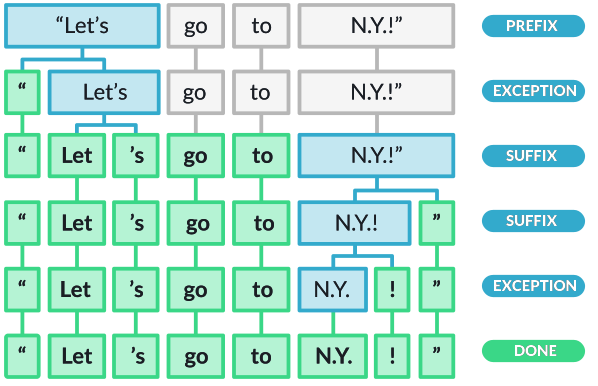

During processing, spaCy first **tokenizes** the text, i.e. segments it into
words, punctuation and so on. This is done by applying rules specific to each
language. For example, punctuation at the end of a sentence should be split off
– whereas "U.K." should remain one token. Each `Doc` consists of individual
tokens, and we can iterate over them:

```python
### {executable="true"}
import spacy

nlp = spacy.load("en_core_web_sm")
doc = nlp("Apple is looking at buying U.K. startup for $1 billion")
for token in doc:
    print(token.text)
```

|   0   |  1  |    2    |  3  |   4    |  5   |    6    |  7  |  8  |  9  |   10    |
| :---: | :-: | :-----: | :-: | :----: | :--: | :-----: | :-: | :-: | :-: | :-----: |
| Apple | is  | looking | at  | buying | U.K. | startup | for | \$  |  1  | billion |

First, the raw text is split on whitespace characters, similar to
`text.split(' ')`. Then, the tokenizer processes the text from left to right. On
each substring, it performs two checks:

1. **Does the substring match a tokenizer exception rule?** For example, "don't"
   does not contain whitespace, but should be split into two tokens, "do" and
   "n't", while "U.K." should always remain one token.

2. **Can a prefix, suffix or infix be split off?** For example punctuation like
   commas, periods, hyphens or quotes.

If there's a match, the rule is applied and the tokenizer continues its loop,
starting with the newly split substrings. This way, spaCy can split **complex,
nested tokens** like combinations of abbreviations and multiple punctuation
marks.

> - **Tokenizer exception:** Special-case rule to split a string into several
>   tokens or prevent a token from being split when punctuation rules are
>   applied.
> - **Prefix:** Character(s) at the beginning, e.g. `$`, `(`, `“`, `¿`.
> - **Suffix:** Character(s) at the end, e.g. `km`, `)`, `”`, `!`.
> - **Infix:** Character(s) in between, e.g. `-`, `--`, `/`, `…`.



While punctuation rules are usually pretty general, tokenizer exceptions
strongly depend on the specifics of the individual language. This is why each
[available language](/usage/models#languages) has its own subclass, like
`English` or `German`, that loads in lists of hard-coded data and exception
rules.
